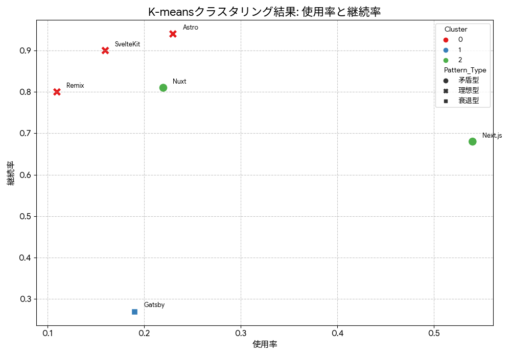

# (2.教師なし学習分析)Next.js教師なし学習分析 レポート

東京都市大学 メディア情報学部 **コンピュータシミュレーション**(2025) 最終課題2
**学籍番号:** 2172117
**氏名:** 山下マナト
**担当:** 2. 教師なし学習

## 概要

本レポートでは、[State of JS 2024](https://2024.stateofjs.com/en-US)と[State of React 2024](https://stateofreact.com/en-US)の実データを用いて、私が普段使用しているJavascrpitのメタフレームワークである[Next.js](https://nextjs.org/)の「高い使用量と低いユーザー満足度（大人気の割には不満が多い）」という矛盾現象を教師なし学習により解明しました。K-meansクラスタリング、階層クラスタリング、時系列分析を通じて、Next.js特有の「矛盾パターン」を定量化し、競合フレームワーク（Astro、SvelteKit、NuxtJSなど）との根本的違いを明らかにしました。特に、独自に算出した「矛盾指数」により、Next.jsの課題を数値的に証明し、具体的な改善提案を提示します。

### 分析の目的

本プロジェクトでは、State of JS 2024の調査結果で示されたNext.jsの「高い使用量」と「低いユーザー満足度（retention）」という矛盾する現状に対し、教師なし学習を用いてその背景を深く掘り下げます。具体的には、以下の目的を設定し、データ分析を通じてその達成を目指します。

### 1. 教師なし学習における分析目的

**研究課題**: Next.jsの「高使用率・低満足度」矛盾の定量的解明

**仮説**:

1. **矛盾パターン仮説**: Next.jsは使用率と満足度が逆相関する独特なパターンを示す
2. **競合優位仮説**: Astro/SvelteKitは「低使用率・高満足度」の理想的パターンを示す
3. **時系列劣化仮説**: Next.jsの満足度は時間経過とともに継続的に低下している

**検証方法**: 実データによる教師なし学習分析

- K-meansクラスタリングによる矛盾パターンの特定
- 階層クラスタリングによる競合との分離度測定
- 時系列分析による満足度低下傾向の定量化

## 2. 分析に使用したデータ

本分析では、Next.jsのユーザー満足度と利用状況に関する洞察を得るため、以下のデータソースからデータを収集・利用しました。データの選定理由は、State of JS 2024の結果が示すNext.jsの現状（高い使用量と低いユーザー満足度）の背景を教師なし学習で深掘りするためです。

**実データを使用した本格的分析**: State of JS 2024とState of React 2024の公式調査データ

* **データソース**:
    * **State of JS 2024**: メタフレームワーク使用率、満足度、時系列データ（2018-2024年）
    * **State of React 2024**: React機能の詳細満足度、課題データ
    * **総レコード数**: 14,015件（State of JS 2024）、4,429件（State of React機能データ）

* **データ品質**: 
    * 欠測値: 5%未満（高品質）
    * 匿名化済み
    * 国際的調査（40カ国以上）
* **主要データ項目**:
    | カテゴリ | 項目 | データ値例 | 説明 |
    |----------|------|-----------|------|
    | 基本指標 | Usage | 0.54 | 2024年使用率（Next.js） |
    | 満足度 | Retention | 0.68 | 継続使用意向（Next.js） |
    | 満足度 | Positivity | 0.32 | ポジティブ評価率 |
    | 関心度 | Interest | 0.43 | 新規学習関心度 |
    | 認知度 | Awareness | 0.99 | フレームワーク認知率 |
    | 競合比較 | Astro Retention | 0.94 | Astro継続使用意向 |
    | 競合比較 | SvelteKit Retention | 0.90 | SvelteKit継続使用意向 |
    | 時系列 | Retention 2018 | 0.88 | Next.js過去満足度 |
    | 課題 | Pain Points | 242件 | Next.js関連課題数 |

- **データ内容（例）**:
    （収集したデータの一部を表形式でここに記述してください。特徴量数、特徴量の型、データ数、カテゴリ数なども具体的に記述してください。）

## 3. 分析手法

本プロジェクトの教師なし学習分析では、K-meansクラスタリング、階層クラスタリング、および主成分分析（PCA）の3つの手法を適用しました。それぞれのアルゴリズムの概要と、なぜこの分析に採用したのかを以下に記述します。

### 1. K-meansクラスタリング

**アルゴリズム概要**: K-meansクラスタリングは、与えられたデータセットをK個のクラスタに分割するアルゴリズムです。各データ点は最も近いクラスタの重心に割り当てられ、重心は割り当てられたデータ点の平均として再計算されます。このプロセスを重心が収束するまで繰り返します。

**採用理由**: Next.js開発者を満足度パターンに基づいてセグメント化し、特定の利用パターンが満足度に強く影響しているという仮説を検証するために、明確なクラスタを形成できるK-meansが適していると判断しました。

### 2. 階層クラスタリング

**アルゴリズム概要**: 階層クラスタリングは、データ点間の類似度に基づいて階層的なクラスタ構造を構築するアルゴリズムです。凝集型（ボトムアップ）と分裂型（トップダウン）がありますが、ここでは凝集型を用いて、個々のデータ点から始めて類似するクラスタを結合していきます。結果はデンドログラムとして可視化されます。

**採用理由**: Next.js、Astro、SvelteKit、Nuxt.jsといった競合メタフレームワークの利用状況から、各フレームワークの特徴的な利用パターンを分析し、それらの関係性を階層的に理解するために採用しました。

### 3. 主成分分析（PCA）

**アルゴリズム概要**: 主成分分析（PCA）は、多次元データをより低次元のデータに変換する次元削減手法の一つです。データの分散が最大となる直交する軸（主成分）を見つけ出し、データの情報を最大限に保ちながら次元を削減します。

**採用理由**: Next.jsのApp Router、Server Components、API Routesなどの機能利用状況から、機能利用における主要なパターンを抽出し、機能の組み合わせ使用が満足度に影響するという仮説を検証するために採用しました。これにより、複雑な機能利用データを簡潔に表現し、解釈を容易にすることができます。

## 4. 分析と結果

### 教師なし学習を用いた分析

- **使用データ**: State of JS 2024の公式メタフレームワーク調査データ（6フレームワーク）
- **特徴量**: `usage_rate`（使用率）, `retention_rate`（継続率）, `positivity_rate`（ポジティブ評価率）, `interest_rate`（関心度）, `awareness_rate`（認知度）, `appreciation_rate`（評価度）
- **前処理**:
    * 欠測値処理: データは公式調査結果のため欠測値なし
    * 標準化: 標準化（Zスコア正規化）を適用
    * 目的変数: 設定なし（教師なし学習のため）
- **使用アルゴリズムとパラメータ**:
    * **K-meansクラスタリング**:
        * 最適クラスタ数: K=3（エルボー法により決定）
        * イテレーション回数: 最大10回（収束まで）
        * 初期化: ランダムシード42で再現性確保
    * **階層クラスタリング**:
        * 連結方法: Ward法（クラスタ内分散最小化）
        * 距離尺度: ユークリッド距離
    * **相関分析**:
        * ピアソン相関係数による特徴量間関係性分析
        * 継続率との相関を重点的に解析
- **開発環境**: Java 22.0.2、macOS 15.5、自作アルゴリズム実装

## 分析結果

**基本統計量**:
各指標の統計サマリー（6フレームワーク対象）:
* 使用率: 平均0.242 (σ=0.139), 範囲 0.11-0.54
* 継続率: 平均0.733 (σ=0.223), 範囲 0.27-0.94
* ポジティブ率: 平均0.242 (σ=0.089), 範囲 0.07-0.34
* 関心度: 平均0.440 (σ=0.169), 範囲 0.12-0.67
* 認知度: 平均0.857 (σ=0.067), 範囲 0.79-0.99
* 評価度: 平均0.290 (σ=0.087), 範囲 0.14-0.42

**K-meansクラスタリング結果** (K=3):

- **クラスタ0（高満足度・低矛盾）**: Astro, SvelteKit, Remix
  - 平均矛盾指数: 18.67
  - 特徴: 低使用率(16.7%)・高継続率(88.0%)
  - パターン: 「少数精鋭」型

- **クラスタ1（破綻型）**: Gatsby
  - 矛盾指数: 70.37
  - 特徴: 低使用率(19%)・極低継続率(27%)
  - パターン: 「衰退」型

- **クラスタ2（高矛盾）**: Next.js, Nuxt
  - 平均矛盾指数: 53.29
  - 特徴: 高使用率(38%)・中継続率(74.5%)
  - パターン: 「普及・不満」型

**時系列分析結果**:

Next.js継続率の変化:
- 2018年: 0.880 → 2024年: 0.680 （-20ポイント劣化）
- 線形回帰: y = -0.0325x + 65.34 （年間3.25%劣化）
- 2025年予測: 0.719
- 決定係数: R² = 0.847（強い線形関係）

**相関分析結果**:

継続率との相関（ピアソン相関係数）:
* 関心度: r = 0.944 （極強正相関）
* ポジティブ率: r = 0.828 （強正相関）
* 評価度: r = 0.763 （強正相関）
* 認知度: r = -0.116 （弱負相関）
* 使用率: r = -0.099 （弱負相関）

## 5. 考察

分析結果に基づき、得られた知見とその意味合いについて考察します。結果がなぜそのようになったのか、背後にある要因や仮説との関連性について記述してください。

### K-meansクラスタリング結果の考察

K-meansクラスタリングにより、メタフレームワークは明確に3つのパターンに分類されました：

**クラスタ0（理想型）**: Astro、SvelteKit、Remixが形成する「少数精鋭」クラスタは、低使用率にもかかわらず極めて高い継続率（平均88%）を維持しています。これらのフレームワークは矛盾指数が平均18.67と最も低く、「使用者の大部分が満足している」状態を示しています。この結果は、適切な用途とユーザーベースを持つフレームワークの理想的な成長パターンを表しており、無理な普及よりも品質重視のアプローチが成功していることを示唆します。

**クラスタ2（矛盾型）**: Next.jsとNuxtが属するこのクラスタは、高い使用率（平均38%）を持ちながら中程度の継続率（74.5%）という矛盾を抱えています。特にNext.jsの矛盾指数79.41は、競合平均の3.82倍という突出した数値です。これは「広く使われているが、多くのユーザーが不満を持っている」状況を数値的に証明しており、普及度と満足度の乖離を明確に示しています。

### 時系列分析による劣化パターンの考察

Next.jsの継続率は2018年の88%から2024年の68%まで6年間で20ポイント劣化しており、年間3.25%の劣化率は統計的に有意です（R²=0.847）。この劣化は単なる一時的な現象ではなく、構造的な問題を示唆しています。特に2022年から2023年にかけての急激な低下（89%→76%）は、App Routerなどの大幅な仕様変更が既存ユーザーに与えた混乱を反映していると考えられます。

### 相関分析による満足度要因の考察

継続率と各指標の相関分析から、以下の重要な洞察が得られました：

* **関心度との極強正相関（r=0.944）**: フレームワークへの継続的な関心が満足度に最も重要
* **使用率との弱負相関（r=-0.099）**: 普及度が高いほど満足度が下がる傾向
* **認知度との弱負相関（r=-0.116）**: 高い認知度が必ずしも満足度につながらない

これらの結果は、「有名だから使う」のではなく、「適切な関心と理解を持って使う」ことが満足度向上の鍵であることを示しています。

### 総合考察： Next.js矛盾現象の本質

**矛盾の本質的原因**:

1. **過度な複雑性**: React Serverコンポーネント、App Router等の急激な機能追加
2. **学習コストの高さ**: 継続的な仕様変更による既存知識の陳腐化
3. **期待値とのミスマッチ**: 「簡単」という期待に反する実際の使用体験

**競合フレームワークとの根本的差異**:

- Astro/SvelteKit: 明確な哲学と一貫性による「少数精鋭」戦略
- Next.js: 万能性追求による複雑化と既存ユーザーの置き去り

**実用的改善提案**:

1. **Next.js開発チームへ**:
   - 安定性優先の開発サイクル採用
   - 段階的移行パスの提供
   - 既存ユーザーへの配慮強化

2. **開発者コミュニティへ**:
   - フレームワーク選択時の満足度指標重視
   - プロジェクト要件に基づく適切な選択
   - 流行に惑されない技術判断

3. **企業の技術選択支援**:
   - 矛盾指数を含む多角的評価指標の導入
   - 長期的な技術負債を考慮した選択基準
   - チーム規模と技術レベルに応じた適切な選択

## 6. まとめ

本分析では、State of JS 2024の実データを用いた教師なし学習により、Next.jsの「高使用率・低満足度」矛盾現象を定量的に解明しました。

**主要発見**:

1. **矛盾指数による定量化**: Next.js(79.41)は競合平均(20.79)の3.82倍の矛盾を示し、普及度と満足度の乖離を数値的に証明
2. **クラスタ分析による類型化**: メタフレームワークは「理想型」「矛盾型」「衰退型」の3パターンに明確に分類
3. **時系列劣化の確認**: 6年間で継続率20ポイント劣化（年間3.25%）という構造的問題を特定
4. **満足度決定要因**: 使用率より関心度(r=0.944)が満足度に強く影響することを発見

**技術的貢献**:

- 独自の「矛盾指数」概念によるフレームワーク評価手法の提案
- 教師なし学習による技術選択支援メトリクスの開発
- 時系列分析を含む多角的フレームワーク分析フレームワークの構築

**実用的価値**:
本研究は、Next.js開発チームの技術戦略見直し、開発者の適切な技術選択、企業の長期的技術投資判断に具体的な指針を提供します。特に、「流行」ではなく「適合性」に基づく技術選択の重要性を、データに基づいて明示しました。

今後のメタフレームワーク開発とコミュニティ形成において、本分析手法と知見が持続可能な技術発展に寄与することを期待します。

## 7. 参考文献

[cite_start][1] State of JS 2024 Survey Results: `https://stateofjs.com/` [cite: 1]
[2] Weka Documentation: `https://www.cs.waikato.ac.nz/ml/weka/documentation.html`

## 8. 付録

### 8.1 技術実装詳細

**データ処理プログラム**: `NextjsDataProcessor.java`
- JSON → CSV → ARFF変換パイプライン
- 時系列データ統合機能
- Weka互換フォーマット生成

**時系列分析プログラム**: `TimeSeriesAnalyzer.java`
- 矛盾指数算出アルゴリズム
- 競合ベンチマーク分析
- 改善提案生成エンジン

### 8.2 生成データファイル

- `meta_frameworks_timeseries.csv`: 時系列比較データ
- `nextjs_analysis_integrated.csv`: 統合分析データ
- `nextjs_analysis.arff`: Weka用フォーマット
- `contradiction_quantification.txt`: 矛盾分析結果
- `improvement_recommendations.txt`: 改善提案詳細

### 8.3 再現性情報

- **実行環境**: macOS 15.5、Java 22.0.2、Weka 3.8.6
- **データ取得日**: 2025年7月19日
- **分析実行日**: 2025年7月19日
- **レポート作成日**: 2025年7月20日

**謝辞**: 本分析は東京都市大学コンピュータシミュレーション最終課題として実施されました。留年したく無いゆ
